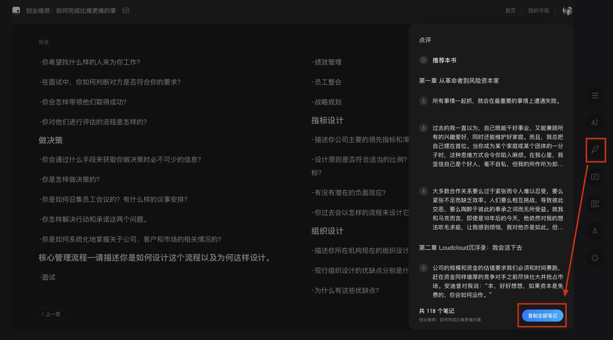
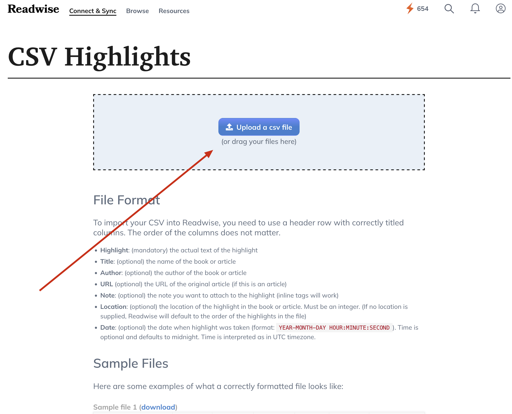

# WeRead-to-Readwise

## 简介

这个工具用于解析微信读书的笔记文件，并将其转换为符合 Readwise 格式的 CSV 文件。你可以使用这个工具将微信读书中的高亮和笔记导出为一个 CSV 文件，方便导入到 Readwise 进行进一步处理和分析。

## 功能

- 解析微信读书笔记文件，提取书名、作者、高亮和笔记。
- 将解析后的数据写入符合 Readwise 格式的 CSV 文件。

## 使用方法

1. **安装依赖**：
   确保你已经安装了 Python 3.x。
2. **拷贝微信读书笔记到文件**：
   将微信读书的笔记文件拷贝到当前目录下，例如 `hard-things.txt`。
   
3. **运行脚本**：
   使用以下命令运行脚本，并指定微信读书笔记文件的路径：

   ```bash
   python main.py <path_to_weread_notes>
   ```

   例如：

   ```bash
   python main.py ./hard-things.txt
   ```

4. **查看输出**：
   脚本会在同一目录下生成一个符合 Readwise 格式的 CSV 文件，文件名为笔记文件的名称加上 `.csv` 后缀。例如，如果你的笔记文件名为 `notes.txt`，则生成的 CSV 文件名为 `notes.csv`。
5. **导入到 Readwise**：
   将生成的 CSV 文件导入到 Readwise 中，即可在 Readwise 中查看和管理你的笔记。
   

## 示例

假设你有一个名为 `hard-things.txt` 的微信读书笔记文件，内容如下：

```txt
《创业维艰：如何完成比难更难的事》

本·霍洛维茨
118个笔记

点评

◆ 2024/09/09 认为好看


第一章 从革命者到风险资本家

◆ 所有事情一起抓，就会在最重要的事情上遭遇失败。

◆ 过去的我一直以为，自己既能干好事业，又能兼顾所有的兴趣爱好，同时还能维护好家庭。而且，我总把自己摆在首位。当你成为某个家庭或某个团体的一分子时，这种思维方式会令你陷入麻烦。在我心里，我坚信自己是个好人，毫不自私，但我的所作所为却暴露出我并非这样的好人。我绝不能像这样继续幼稚下去，我必须分清主次轻重，成熟起来。我必须先考虑自己最关心的人，然后再考虑自己。

◆ 大多数合作关系要么过于紧张而令人难以忍受，要么紧张不足而缺乏效率。人们要么相互挑战，导致彼此交恶，要么陶醉于彼此的奉承之词而无所受益。就我和马克而言，即使是18年后的今天，他依然对我的想法吹毛求疵，让我感到烦恼，我对他亦是如此。但事实证明，这种方式对企业的发展有益无害。
```

运行脚本后，生成的 `hard-things.csv` 文件内容如下：

```csv
Highlight,Title,Author,URL,Note,Location,Date
2024/09/09 认为好看,创业维艰：如何完成比难更难的事,本·霍洛维茨,,,1,2024-09-30 17:07:00
所有事情一起抓，就会在最重要的事情上遭遇失败。,创业维艰：如何完成比难更难的事,本·霍洛维茨,,,2,2024-09-30 17:07:00
过去的我一直以为，自己既能干好事业，又能兼顾所有的兴趣爱好，同时还能维护好家庭。而且，我总把自己摆在首位。当你成为某个家庭或某个团体的一分子时，这种思维方式会令你陷入麻烦。在我心里，我坚信自己是个好人，毫不自私，但我的所作所为却暴露出我并非这样的好人。我绝不能像这样继续幼稚下去，我必须分清主次轻重，成熟起来。我必须先考虑自己最关心的人，然后再考虑自己。,创业维艰：如何完成比难更难的事,本·霍洛维茨,,,3,2024-09-30 17:07:00
大多数合作关系要么过于紧张而令人难以忍受，要么紧张不足而缺乏效率。人们要么相互挑战，导致彼此交恶，要么陶醉于彼此的奉承之词而无所受益。就我和马克而言，即使是18年后的今天，他依然对我的想法吹毛求疵，让我感到烦恼，我对他亦是如此。但事实证明，这种方式对企业的发展有益无害。,创业维艰：如何完成比难更难的事,本·霍洛维茨,,,4,2024-09-30 17:07:00
```

## 贡献

欢迎提交问题和改进建议。如果你有任何想法或发现任何问题，请在 GitHub 上提交 Issue 或 Pull Request。
